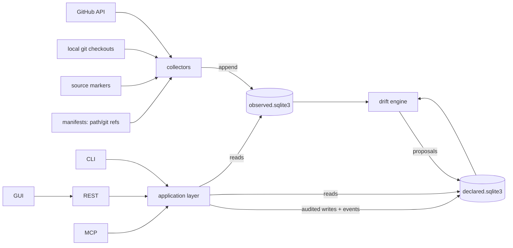

# Vogt — Data Schema & Topology (v0.3, revision r5)

Status: **built** (reconciled against the delivered v1 on 2026-08-12; the
as-built shape of §3.2 is the note at the end of that section, and the
requirement-by-requirement verification lives with the requirements
baseline, outside this repository; `FR-*`/`NFR-*` IDs are quoted as plain
text).
Types are indicative; DDL is written
at M0. Companion to `DESIGN.md` §3 (domain model) and §7 (storage).

r2 changes: `contracts` and `packages` tables removed; `events` and
`suppressions` tables added; dependency tables reduced to references;
drift proposals carry an evidence snapshot; retention rules tightened.

r3 changes: no sweep roots and no discovery — collector scope is always a
set of registered project ids; `projects.exclusions` replaces per-root
exclusion patterns; contract results are written by on-demand checks only.

r4 changes: `coding_sessions` added (§2.6) for the merge with the session
engine — the declared link between a work item or project and a terminal the
engine runs for it. No other table changed; the engine keeps its own state in
its own `state_dir` and nothing about it is mirrored here.

r5 changes: **no schema change at all.** Session outcomes and bound
agent-task runs (FR-E6, FR-E7) arrive as observations of two new kinds,
`session.outcome` and `agent_task.run`, against two new subject-key shapes
(§3.1) — which is what r4's §2.6 said would happen and what nothing had
built. This revision is recorded because the previous one described that
mechanism as existing: a document that reasons from an unbuilt thing to a
schema decision is the failure the v1 delivery verification found in this
file, and r5 is the correction as well as the build.

## 1. Storage topology

Two SQLite databases with strictly different write disciplines:

```
data-dir/
  declared.sqlite3    # authoritative, mutable, audited, revisioned
  observed.sqlite3    # append-only evidence + derived "latest" tables
  backups/
```



Rules:

- Nothing writes `declared.sqlite3` except the application layer, and every
  write carries `(actor, reason)` and lands an audit row **and an event
  row** in the same transaction.
- Nothing writes `observed.sqlite3` except collectors; rows are immutable
  once written. Retention pruning is the only delete path, and it is
  constrained by §5.
- The drift engine reads both, writes only `drift_proposals` (declared side).
  Accepting a proposal is an ordinary audited application write.
- Cross-database joins happen in the application layer, not SQL `ATTACH`
  (keeps the stores independently portable/backupable). Because every
  aggregate view is therefore a Python-side join, the NFR-S4 benchmark
  fixture exists from M2 to keep that cost visible.

## 2. declared.sqlite3

### 2.1 Identity & audit spine

| Table | Purpose | Key columns |
|---|---|---|
| `meta` | schema version, instance id, monotonic `revision` counter | |
| `migrations` | forward-only migration ledger | `id, applied_at, checksum` |
| `migration_lock` | single-writer migration guard | |
| `actors` | humans **and** agents | `id, kind(human\|agent), display_name, identity_ref, disabled` |
| `tokens` | API credentials bound to actors | `id, actor_id, scopes, token_hash, expires_at, revoked_at` |
| `auth_decisions` | *(M4)* every allow **and** deny, at both `tools/list` and invocation (FR-S5) | `id, at, actor_id, operation, decision(allow\|deny), reason_code, transport` |
| `audit` | every declared write | `id, txn_id, revision, actor_id, operation, entity_kind, entity_id, reason, payload_digest, at` |

Authorization decisions are their own table rather than audit rows: a denial
changes nothing, so it has no entity and no revision to hang from.

`audit` is indexed on `actor_id`, `(entity_kind, entity_id)` and `at`. The
time index is now used: `audit.list` takes `since` (inclusive) and `until`
(exclusive), which closed the FR-S6 gap exactly as this section predicted —
a parameter, not a schema change. It also takes `offset`, so the log is
readable past its newest page, and `total`, so a reader can tell whether it
is showing all of it.

Two queries against this table are worth writing down, because both are
joins and neither is a column:

- **An entity's trail.** Filtering by `entity_id` returns the writes audited
  against that entity *and*, when it is a work item, the writes audited
  against its comments — a comment is audited against the comment
  (`entity_kind = 'comment'`), so an exact match would report that nothing
  had ever been said about it. The link is `comments.work_item_id`, which is
  already indexed. No `work_item_id` is denormalised onto `audit`: answering
  for rows written before such a column existed would mean back-filling the
  one table that may only be appended to.
- **A project's trail.** Filtering by project selects, per entity kind, the
  ids that kind's own table attributes to that project — `projects`,
  `work_items.project_id`, `comments` through their item,
  `coding_sessions.project_id`, `drift_proposals.project_id` and
  `suppressions.scope_project_id`. Those are every audited kind that carries
  a project; `instance`, `actor`, `label`, `initiative` and `token` writes
  belong to the instance, so no project's trail is missing them.

What remains unindexed is the *order*: the log is read newest-first by
`(revision, at, id)` and no index covers that, so every audit query sorts the
rows its filters selected. That was true of the unfiltered query before any
of these filters existed, and it is the next thing to measure if the table
gets big enough to notice — an index on the sort key, or paging by `at`
through `idx_audit_at`, would both fix it without changing what is stored.

### 2.2 Project

| Table | Purpose | Key columns |
|---|---|---|
| `projects` | unit of the per-repo view; one explicitly registered repo or folder (FR-P5, FR-G15) | `id, slug, name, root_path, repo_url, lifecycle_state, current_version, contract_version, compliance_status(compliant\|non_compliant\|not_checked), compliance_checked_at, contract_adopted_at, link_state(unlinked\|linked), exclusions(json), trust_state, created_at, updated_at` |
| `contract_exemptions` | a criterion declared unmeetable by a project, with its reason and its author (FR-G19) | `id, project_id, rule, target, reason, declared_by, declared_at` |
| `initiatives` | cross-project epics | `id, slug, title, body, state(open\|closed), weight, created_at, updated_at` |
| ~~`project_dependencies`~~ | **Not built** — see below | — |

**`project_dependencies` does not exist, and `ref_kind = declared` is
therefore unreachable.** Every dependency edge in the delivered system is
*observed*: `dep-refs` reads manifests and emits `path` and `git` references
into `latest_dep_refs` (§3.2). The third kind survives in the `RefKind` type
and in FR-D2's text, but nothing can produce one — `DESIGN.md` §3.5's
`project link A depends_on B` was never given an operation, and the registry
has no `project.link`. An edge no manifest expresses cannot be recorded.
Tracked as gap **FR-D9** (declared dependency edges have no producer).

*r2 removals*: `contracts` — the contract carries a version string
(`DESIGN.md` §5), so a table of versioned contract bodies bought nothing at
one contract per instance; the evaluated result lives in
`projects.compliance_status` with its `compliance_checked_at`. *As built*,
the contract is a versioned constant in `core/contract.py` rather than
configuration, so there is no per-instance contract body anywhere — which is
why removing the table cost nothing, and is also the FR-G1 gap (the
contract is not configurable per instance).
`packages` — with dependency edges resolved by path and repo URL, published
package identity is no longer needed to build the internal graph.

### 2.3 Work

| Table | Purpose | Key columns |
|---|---|---|
| `work_items` | the unit of work | `id, ref, kind(feature\|bug\|chore\|question), title, body, state, priority(p0..p4), effort, project_id, initiative_id, origin(created\|adopted\|observed), trust_state, assignee_actor_id, superseded_by, created_at, updated_at` |
| `work_relations` | typed DAG edges, cross-project (the four **declarable** kinds) | `work_item_id, related_id, kind(depends_on\|relates_to\|duplicate_of\|parent_of)` |
| `labels` | instance-wide tag definitions (GitHub-label aligned) | `id, name, color` |
| `work_item_labels` | tag assignments | `work_item_id, label_id` |
| `work_links` | link to observed forge objects | `work_item_id, forge_kind(issue\|pr), repo, number, relation(completion\|reference), created_at` |
| `comments` | collaboration | `id, work_item_id, actor_id, body, created_at` |
| `work_overlay` | *(0013, FR-B7)* the vogt-local half of an upstream-truth item on a **linked** project, keyed by the forge subject, not a `wrk_*` id | `subject_key(pk), project_id, rank, workflow_state, priority, effort, assignee_actor_id, initiative_id, branches(json, 0015), created_at, updated_at` |
| `workflow_defs` | state machine per work-item kind | `kind, definition(json)` |
| `writeback_actions` | *(M5)* one row per attempted forge write (FR-B2) | `id, at, actor_id, work_item_id, project_id, policy, action(create\|comment\|label\|close\|reopen), outcome(attempted\|succeeded\|failed\|skipped), detail` |

A fifth relation kind, `implemented_by` (a work item → a pull request), does
**not** live in `work_relations`: it is *observed*, never declared by hand
(#284). The forge sync reads it from a PR's closing keywords and branch name
and stores it on the PR observation's payload (`implements`, each target with
its provenance), so a PR collapses under the work item it implements in the
ranked views. Being observed rather than declared, it informs but never
enforces — unlike `depends_on` it does not block completion — and `work relate`
refuses it.

*The derived git story (#285)* joins these two observed facts — the `git.branch`
observations (#283) and the `implemented_by` PR edge (#284) — into a read-only
answer to *where is this in git?* on `work.get`. It is **not a table and not a
column**: nothing is written. From the branch tips and the PR's observed state
it derives a single **phase** (`no_branch → branch_active → pr_open → in_review
→ merged`) shown *beside* the workflow state, never as it; a PR summary carrying
the PR's derived state, review decision and checks rollup; and the obvious
contradictions between item and evidence as **drift** — a closed item with an
open PR, a merged PR under an open item, a branch active on a done item. Each
carries its provenance and freshness. The same two signals feed the ranker: an
open PR or a recently-committed branch lifts a moving item (`why` shows the
contributions). The engine's per-task run conclusion (#291) is a remaining seam,
not yet an input to the phase.

`writeback_actions` records the *attempt*, not only the success — including
`skipped`, which is what a policy refusal looks like. Write-back is never a
separate operation (`ROADMAP.md` M5): a comment authored here posts upstream
as part of commenting, so this table is the only place the upstream half of
a declared write is visible before the next sweep re-observes it.

*Added at #286*: `initiative.publish` projects an initiative onto **one forge
tracking issue per linked repo** it spans — an issue labelled
`initiative:<slug>` whose body carries a checkbox task list of the member work
items (`- [ ] #<n> <title>`, checked when the member is terminal). It is the one
write-back that *edits* a body rather than only appending, so the provider write
surface gains a single bounded verb, `update_issue_body`, beside the append-only
set (`comment`, `create_issue`, `add_labels`, `set_state`). It stays additive
and forward-only by construction: Vogt rewrites only the span between two
`<!-- vogt:initiative:… -->` markers (the **managed region**) and copies every
other byte of the body through, so a human's own notes survive a re-render, and
it never deletes. A re-run *adopts* the marked issue instead of opening a second
one. The projection is recorded as an audited action (the effect lands upstream,
like `forge.onboard`), not as a declared row. Two consequences reach the drift
table (§2.4): closing the initiative **proposes** closing its tracking issues
(`initiative_tracking_close`) rather than writing the close, and — because the
tracking issue is observed like any other — a human ticking a box upstream out
of step with the member's state surfaces as `initiative_checkbox_drift` on the
next sweep rather than being silently re-rendered away.

*Added at 0013 (#181, FR-B7)*: `work_overlay` carries only what must never
cross the forge boundary — decision 2's invariant — and joins the observed
mirror (which stays the truth for title/labels/open-closed) into the item
every surface returns for a linked project. There is no `wrk_*` row behind an
upstream-truth item: the subject key is its id and its ref. On a failed
write-through nothing lands here, because the provider call runs before the
declared transaction opens (decision 9); `rank` is schema for the vogt-local
ordering with no operation writing it yet. The 0013 migration is new-DDL
only: the deployed cutover starts from a fresh declared store, by decision.

*Added at 0015 (#283)*: `branches` is a JSON array of the branch names a
session started *from Vogt* declared it would work the item on — the declared
half of the branch binding (#287, FR-B4). It is additive and forward-only:
recording a name never touches git. The *observed* half — what a `git-local`
sweep actually finds — stays in the evidence store as `git.branch`
observations and is never folded in here, so the two can be compared and a
disagreement surfaced as drift (FR-O2) rather than one overwriting the other.
The column is keyed the same way the row is — by the work-item ref, which is
`WI-7` for a native item and the forge subject for an upstream one.

*Added at 0014 (#183, FR-B9)*: `work_items.superseded_by` — the retire
marker for native items migrated upstream on `forge.link`/`forge.publish`.
Set once to the new subject key, never cleared; a superseded row is excluded
from every work view (each issue counted exactly once — the upstream item is
the item) while the row itself keeps anchoring its comments, relations,
ledger rows and audit history, and its `WI-n` ref still resolves by direct
read. Retire-by-marker was chosen over deletion for exactly that history,
and no `work_links` row is written for the new subject because the #181
dedup reads one as "this declared row IS the item".

*Added at M1*: `work_items.ref` is the short handle (`WI-7`) allocated from a
counter in `meta`, inside the creating transaction so a rolled-back creation
leaves no gap. Ids stay ULID-shaped and stable; refs are what a human or an
agent actually types, and every parameter that names a work item takes one.
`initiatives` likewise gained a slug for the same reason.

There is deliberately **no `rank_order` column** (decided 2026-08-12).
Ordering is computed from documented weights and is fully explainable by
`why`; manual influence is expressed through `priority` and initiative
weight, which are themselves scored inputs. No hand-set position competes
with the score.

### 2.4 Drift

| Table | Purpose | Key columns |
|---|---|---|
| `drift_proposals` | machine-generated, human/agent-resolved | `id, kind, subject_kind, subject_id, evidence_observation_id, evidence_snapshot(json), proposed_change(json), status(open\|accepted\|rejected\|contested), opened_at, superseded_at, superseded_detail, resolved_by_actor_id, resolved_at, resolution_reason` |

`superseded_at` (r15, FR-R6) marks an **open** proposal whose raising
condition a later completed sweep no longer reproduces. It is not a
resolution and not a status: the row stays `open`, keeps its snapshot, and
still requires a person (FR-R2, FR-U18). It clears again if the condition
returns, because a stale "superseded" tells a reader to ignore a live
proposal. Coverage-gated: nothing is marked unless the collector that raised
it completed a sweep *after* the proposal was opened, since silence outside
a completed sweep is "not collected" (FR-O4).

`evidence_snapshot` (r2, FR-R5) is the self-contained copy of the evidence
as it stood at raise time: the observation payload digest, its
`subject_key`, its `observed_at`, and enough of the payload to explain the
proposal without the observed store. `evidence_observation_id` remains the
pointer to the live row, and observations so referenced are exempt from
retention pruning (§5). A proposal must never outlive its evidence.

Drift kinds (v1):

| Kind | Stage | Notes |
|---|---|---|
| `version_mismatch` | M3 | declared version vs observed tag/release |
| `unresolved_dependency` | M3 | internal-looking reference with no registered target (FR-D5) |
| `forge_state_mismatch` | M5 | linked issue/PR state disagrees |
| `ci_red_vs_healthy` | M5 | CI red on default branch, project claims healthy |
| `vanished_upstream` | M5 | linked forge object absent within provably swept scope |
| `update_automation_gap` | M5 | a required automation toggle is off (FR-D6) |
| `broken_path_dependency` | M3 | a path reference inside the project's own tree resolving to nothing |
| `referenced_issue_state_mismatch` | r15 | a work item's own text names a forge issue whose observed state disagrees (FR-R7) |
| `initiative_checkbox_drift` | #286 | a box on an initiative tracking issue was ticked upstream out of step with the member's workflow state |
| `initiative_tracking_close` | #286 | the initiative is closed here; its tracking issue is still open upstream — a *proposal* to close it, never an automatic write |

*r2 removals*: `contract_violation` and `unregistered_project` are no
longer drift — the first is `projects.compliance_status` (`DESIGN.md` §5),
the second is the candidates listing (FR-G6). `dep_version_skew`,
`lock_manifest_mismatch` and `vendored_divergence` required resolved
versions and are withdrawn with them; the situation the last one described
is reported as the `mirrored_source` observation instead (FR-D8).

### 2.5 Events & suppression (r2)

| Table | Purpose | Key columns |
|---|---|---|
| `events` | the single ordered notification feed (FR-N1) | `seq INTEGER PRIMARY KEY AUTOINCREMENT, kind, entity_kind, entity_id, actor_id, audit_id, summary(json), at` |
| `suppressions` | observed subjects excluded from ranked views (FR-W10) | `id, match_kind(exact\|pattern), subject_key_or_pattern, scope_project_id, actor_id, reason, created_at, revoked_at` |

`events.seq` **is** the `/events` cursor. Two producers, one table:

`events.list` also takes `entity_id`, narrowing the feed to one thing's
history, and that is what makes a work item's *state* history answerable.
`audit` keeps a `payload_digest` rather than the payload — deliberately: it
proves what changed without duplicating it — so the audit alone can say a
transition happened, who made it and why, and not which state it came from.
The event can: `work.transitioned` carries `{ref, from, to}` in its summary,
nothing prunes this table, and the two rows name each other through
`audit_id`. Read together they answer both halves; read apart, each is
missing the other's.

*Implementation note (M0)*: instance creation is the one audited write that
emits **no** event. `vogt init` creates the instance rather than changing
anything inside one, so it writes `meta`, the initiating actor, and an audit
row at revision 0 — and the feed therefore starts at the first change a
client could act on. Everything else, including the auto-registration of a
principal seen for the first time, lands its event in the same transaction as
its entity change and audit row.

1. Declared writes insert their event row inside the same transaction as
   the entity change and audit row (`audit_id` set), so a write is never
   visible without its event and never emits an event it did not commit.
2. Observed-side happenings — sweep completion, CI state transition — are
   published by the *application layer* at sweep completion (`audit_id`
   null, `summary` naming the sweep). Collectors still never write the
   declared store; the application publishes on their behalf.

This is why no client merges orderings across the two databases: the
observed store has no cursor of its own and does not need one.

`suppressions` lives in the declared store because it is an audited human
or agent decision, not an observation — which is also why it survives
re-observation of the same `subject_key`.

### 2.6 Coding sessions (r4)

| Table | Purpose | Key columns |
|---|---|---|
| `coding_sessions` | *(M10)* the declared link from a work item or project to a terminal the engine runs for it (FR-E4) | `id, engine_session_id(unique), project_id, work_item_id, actor_id, cwd, template, reason, started_at, stopped_at` |

This table records what Vogt *asked for*: a session, in this project's tree,
for this item, attributed to this actor (FR-S10), with a reason — an ordinary
audited declared write. It holds nothing about what is happening inside the
terminal. Live activity (`idle`/`running`/`waiting-for-input`/`errored`),
scrollback and exit code are the engine's, published on its SSE stream and
read from it when a view needs them (FR-E2); a cached column would be stale
the moment it was written, and a view that renders stale state as current is
the failure FR-U10 and FR-U21 exist to prevent. `stopped_at` is not a
counter-example: it says Vogt stopped the session, not that the process ended.

Session **outcomes** — exit code, duration, resulting working-tree delta —
are evidence, not declaration: they are collected as observations with
freshness and trust like everything else (FR-E6, §3.1), which is why there is
no outcome column here. "What did we ask for, and why" and "what happened in
there" are different questions with different write disciplines.

*This paragraph described a mechanism that did not exist until r5.* It was
written at r4 as the reason for an absent column and was read for a year as a
statement of fact; the v2 delivery verification is what caught it. The
mechanism is now the `session-outcomes` collector
(`src/vogt/collectors/session_outcomes.py`), and what it can and cannot say is
worth knowing before trusting a number it produced:

| Fact | Where it comes from | When it is absent |
|---|---|---|
| exit code | the engine — its live session while it has one, then its archive (`GET /api/history/{id}`) | the engine was restarted and kept no archive: the outcome's `state` is `unknown`, never `finished` with a null code |
| duration | the engine's archive, `created_at` to `ended_at` — one clock for both ends | no archive: the fallback is Vogt's `started_at` to the end it recorded, and `duration_source` says which of the two was used |
| working-tree delta | `git` in the session's `cwd`, over the window between its start and its end | the window has no known end, in which case no commits are counted at all |

Three properties of that collector are load-bearing rather than incidental.

**A session that has not finished has no outcome.** Its observation carries
`state: running` and `provisional: true` (FR-U17) with no exit code and no
duration — because an outcome row with a null exit code cannot be told apart
from one whose exit code was lost, which is the confusion this store exists to
prevent. It also carries no activity state: an observation is a timestamped
copy, and copying live activity into one is the same mistake as the cached
column this section rules out.

**The delta is a window, not an attribution.** Vogt takes no snapshot of the
tree when a session starts, so what the delta reports is every commit in the
session's window, whoever made it (`attributed_to_the_session: false`). A
*finished* session's delta reports only the window's commits and deliberately
not what is uncommitted now: a dirty tree would otherwise write a new evidence
row on every sweep, which is growth proportional to how often we look rather
than to what changed (FR-O7). What a session left uncommitted is knowable only
while it runs, and is on the provisional row.

**Agent-task runs come back the same way** (FR-E7). A task in the engine may
name a Vogt project or work item; the runs of a bound task, and the findings
those runs reported, are collected as `agent_task.run` observations against
that subject. The engine never writes here, and that is the whole design: §1's
rule that nothing writes `observed.sqlite3` except collectors is what makes an
observation's freshness and coverage mean anything, and FR-E7's "recordable as
observations" is therefore a *pull*.

What that leaves unbuilt is worth naming rather than implying. A run cannot
file an observation of its own choosing — arbitrary kind, arbitrary subject,
arbitrary payload — because that would be a second writer of this store, with
no sweep behind it and no coverage record to make its silence readable. What a
run can report is a line, through the notify phrase it was already using, and
what Vogt collects is that line against the subject the task was bound to. An
agent that wants to say something structured about a work item has the write
plane it has always had: the declared side, through an audited operation, with
an actor and a reason.

`cwd` is stored per session rather than read back through `projects.root_path`
because FR-E3 is about the path a session actually opened in: a project that
moves later must not silently rewrite where a past session ran.
`engine_session_id` is unique because everything arriving from the engine's
side names a terminal by that id alone.

## 3. observed.sqlite3

### 3.1 Evidence (append-only)

| Table | Purpose | Key columns |
|---|---|---|
| `sweeps` | collector coverage records — makes "absent" ≠ "not collected" | `id, collector, scope(json), started_at, finished_at, outcome(ok\|partial\|failed), stats(json)` |
| `observations` | one immutable evidence row | `id, sweep_id, collector, kind, subject_key, payload(json), content_digest, source_url, observed_at` |

`subject_key` is a deterministic natural key, e.g.
`gh:owner/repo#123`, `ci:owner/repo@sha:workflow`, `mark:repo/path#L42`,
`release:owner/repo@tag`, `depref:repo/Cargo.toml→../nzb-core`,
`depscan:project-slug` (r15), `mirror:project/path->project` (r15, FR-D8),
`contract:project-slug`, `session:<session id>` (r5, FR-E6),
`task-run:<run id>` (r5, FR-E7), `sync:<collector>/<owner>/<repo>` (the
per-project forge-sync receipt, #173). Same `subject_key` + same `content_digest`
in a new sweep ⇒ no new row (sweep stats count it as unchanged), keeping
growth proportional to change, not to polling frequency.

*r15, a consequence worth stating*: `observed_at` is **when a payload was
first seen, not when it was last confirmed**. `observations` rows stay
immutable, so the per-subject "last confirmed" record that closes this is a
separate table — `subject_seen` (§3.3, #173) — touched on every sync batch
including the batches where nothing changed. The two effects r15 recorded as
residuals are now closed by construction rather than deferred: a forge issue
closed after its last observation is re-observed as `closed` because the sync
reads `state=all` incrementally (`forge-issues`/`forge-prs` replaced the
open-only `gh-issues`/`gh-prs`), so a close is a payload change, not an
absence; and trust reads `subject_seen.last_confirmed_at` rather than
`observed_at` (Phase 3). `latest_dep_refs` staleness is unchanged and remains
an r15 residual.

The two session keys are Vogt's own ids rather than the engine's, deliberately:
a session's subject is the thing Vogt declared, so its evidence survives an
engine that forgot the terminal, and a re-observed session is the same subject
whatever the engine now calls it. `session:` is also the key that makes the
running→finished transition one subject with two rows rather than two subjects.

Marker observations carry a `promoted` flag derived from the FR-W11
promotion pattern, so unpromoted markers stay queryable without entering
backlog views.

### 3.2 Derived (rebuilt, not source of truth)

**As built — two tables:**

| Table | Purpose |
|---|---|
| `latest_observations` | newest observation per `subject_key`, generic: kind, project, payload, `promoted`. Every typed read below is a query over `kind` against this. |
| `latest_dep_refs` | one row per (project, target): `ref_kind(path\|git\|declared)`, raw target, manifest file it was read from, resolved `to_project_id` or null (FR-D1–D4) |

Derived tables are rebuilt transactionally at sweep completion from
`observations`; they can always be dropped and regenerated, bounded by the
retention horizon (§5).

*Originally specified, and why they are queries instead of tables (M2)*:
`latest_forge_items`, `latest_ci_runs`, `latest_contract_checks`,
`latest_releases`, `latest_markers` and — from M5 —
`latest_autoupdate_posture` were each named as their own typed projection.
Only `latest_dep_refs` carries anything the observation does not already
state (resolution to a registered project, FR-D3); the rest differed in
payload shape and not in behaviour. Seven rebuild paths would have been
seven places for a collector and its projection to drift apart, so the
others are `kind` filters over `latest_observations`. Update-automation
posture arrived at M5 the same way — observation kind `posture`, subject
`posture:<owner>/<repo>`, three independent facts in the payload (FR-D6) —
rather than as the table named here. Recorded in the migration.

Where the rest of this document names one of those tables (§2.4 compliance,
§4 trust and observed-first), read it as "the newest observation of that
kind". `projects.compliance_status` is a real column and is written by the
on-demand contract check; what does not exist is a `latest_contract_checks`
table behind it.

*r2*: `latest_dependencies` (requested spec, locked version,
direct/transitive) is replaced by `latest_dep_refs`. No lockfile is parsed
and no version is resolved.

### 3.3 Forge-sync bookkeeping (`0004_forge_sync`, #173)

Neither of these is evidence a person asserted — they are the incremental
sync's own bookkeeping — so they live here rather than in `declared`, where
every write needs an actor and a reason (D1). Both are mutable, unlike
`observations`.

| Table | Purpose | Key columns |
|---|---|---|
| `sync_state` | the incremental watermark: how far a collector has synced a project | `collector, project_id, watermark, updated_at`, PK `(collector, project_id)` |
| `subject_seen` | when each subject was last **confirmed to still exist** upstream, touched on every sync batch including unchanged ones | `subject_key` (PK), `last_confirmed_at` |

`watermark` is the max upstream `updated_at` the collector has seen for the
project; the next sweep asks the forge for everything changed since (less a
small overlap), so a closure between sweeps is observed rather than missed.
`subject_seen` is what lets trust be read from "last confirmed" rather than
"last changed" while `observations` stays immutable and `observed_at` stays
first-seen — closing the r15 residual named in §3.1.

## 4. Cross-store semantics

- **Trust computation**: `verified` = declared row's linked subjects were
  seen in a sweep newer than `verify_horizon` and agree; `stale` = last
  agreeing observation older than horizon; `unverified` = no linked
  observation ever; `disputed` = open drift proposal. Computed, never
  hand-set. The trust state is `disputed`, not `contested` (decided
  2026-08-12): `contested` is reserved for the drift *resolution* status,
  where it names something a human deliberately chose.
- **Coverage-gated absence**: "issue vanished upstream" may only be asserted
  when a completed sweep's `scope` provably included that subject and the
  observation is absent. Otherwise the answer is "not collected", surfaced
  as such in API responses.
- **Observed-first work**: forge items (`latest_observations` filtered to
  the issue and PR kinds) and *promoted* markers
  appear in backlog/bug views immediately (trust `unverified→verified` via
  sweeps). `adopt` promotes one into `work_items` with `origin=adopted` and
  a `work_links` row; drift then keeps the pair honest.
- **Suppression filter**: every ranked or aggregated read applies
  `suppressions` (exact and pattern, unrevoked) and the `promoted` flag
  before scoring. Suppressed subjects remain returnable by explicit
  observation queries — the decision hides them from views, it does not
  delete evidence.
- **Compliance**: `projects.compliance_status` is written directly when an
  on-demand contract check runs against a registered project (r3 — nothing
  refreshes it on a timer); the same check lands a `contract:<slug>`
  observation, so the evidence outlives the column. It
  is always read together with `compliance_checked_at`, and no code path
  treats it as a precondition (`DESIGN.md` §2.1, FR-G13/FR-G14).
- **Scope**: every collector's `scope` is a set of registered project ids.
  The system has no notion of an unregistered path (FR-G15), so coverage
  questions are always answerable against a known finite list.

## 5. Scale envelope & retention (v1 targets)

Single node, SQLite WAL mode: ≤ ~500 projects, ≤ ~100k work items. A seeded
fixture exists from M2 and asserts the interactive-query target in CI
(NFR-S4) — *as built*, at 500 projects and **5,000** work items rather than
100k, because seeding 100k rows per run costs minutes and proves nothing
about the query shape. It is a tripwire for an accidental per-item query
inside a ranked view; it is not evidence of the NFR-S1 envelope (the
ranked views staying interactive at the stated estate size).

Retention (NFR-I5), in precedence order — a row is pruned only if no rule
protects it:

1. The **latest** observation per `subject_key` is kept indefinitely.
   Digest dedup (FR-O7) means a stable subject's latest row can be older
   than the history window, so age alone must never prune it.
2. Any observation referenced by a `drift_proposals` row — of any status,
   including resolved — is kept (FR-R5).
3. All other history is pruned by configurable policy (default 180 days).

Postgres is a later backend behind the storage interface if the envelope is
outgrown; the schema avoids SQLite-only features to keep that door open.
