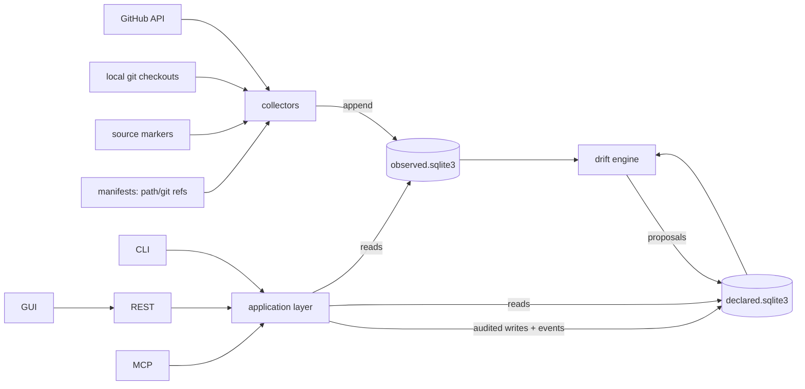

# Vogt — Data Schema & Topology (v0.3, revision r4)

Status: **built** (reconciled against the delivered v1 on 2026-08-12; the
as-built shape of §3.2 is the note at the end of that section, and the
requirement-by-requirement verification is `REQUIREMENTS.md` §5).
Types are indicative; DDL is written
at M0. Companion to `DESIGN.md` §3 (domain model) and §7 (storage).

r2 changes: `contracts` and `packages` tables removed; `events` and
`suppressions` tables added; dependency tables reduced to references;
drift proposals carry an evidence snapshot; retention rules tightened.

r3 changes: no sweep roots and no discovery — collector scope is always a
set of registered project ids; `projects.exclusions` replaces per-root
exclusion patterns; contract results are written by on-demand checks only.

r4 changes: `coding_sessions` added (§2.6) for the merge with the session
engine — the declared link between a work item or project and a terminal the
engine runs for it. No other table changed; the engine keeps its own state in
its own `state_dir` and nothing about it is mirrored here.

## 1. Storage topology

Two SQLite databases with strictly different write disciplines:

```
data-dir/
  declared.sqlite3    # authoritative, mutable, audited, revisioned
  observed.sqlite3    # append-only evidence + derived "latest" tables
  backups/
```



Rules:

- Nothing writes `declared.sqlite3` except the application layer, and every
  write carries `(actor, reason)` and lands an audit row **and an event
  row** in the same transaction.
- Nothing writes `observed.sqlite3` except collectors; rows are immutable
  once written. Retention pruning is the only delete path, and it is
  constrained by §5.
- The drift engine reads both, writes only `drift_proposals` (declared side).
  Accepting a proposal is an ordinary audited application write.
- Cross-database joins happen in the application layer, not SQL `ATTACH`
  (keeps the stores independently portable/backupable). Because every
  aggregate view is therefore a Python-side join, the NFR-S4 benchmark
  fixture exists from M2 to keep that cost visible.

## 2. declared.sqlite3

### 2.1 Identity & audit spine

| Table | Purpose | Key columns |
|---|---|---|
| `meta` | schema version, instance id, monotonic `revision` counter | |
| `migrations` | forward-only migration ledger | `id, applied_at, checksum` |
| `migration_lock` | single-writer migration guard | |
| `actors` | humans **and** agents | `id, kind(human\|agent), display_name, identity_ref, disabled` |
| `tokens` | API credentials bound to actors | `id, actor_id, scopes, token_hash, expires_at, revoked_at` |
| `auth_decisions` | *(M4)* every allow **and** deny, at both `tools/list` and invocation (FR-S5) | `id, at, actor_id, operation, decision(allow\|deny), reason_code, transport` |
| `audit` | every declared write | `id, txn_id, revision, actor_id, operation, entity_kind, entity_id, reason, payload_digest, at` |

Authorization decisions are their own table rather than audit rows: a denial
changes nothing, so it has no entity and no revision to hang from.

`audit` is indexed on `actor_id`, `(entity_kind, entity_id)` and `at`. The
time index exists and is unused — the audit query exposes actor, operation
and entity filters but no time bound (the FR-S6 gap, `REQUIREMENTS.md`
§5.1), so closing that gap is a parameter, not a schema change.

### 2.2 Project

| Table | Purpose | Key columns |
|---|---|---|
| `projects` | unit of the per-repo view; one explicitly registered repo or folder (FR-P5, FR-G15) | `id, slug, name, root_path, repo_url, lifecycle_state, current_version, contract_version, compliance_status(compliant\|non_compliant\|not_checked), compliance_checked_at, exclusions(json), trust_state, created_at, updated_at` |
| `initiatives` | cross-project epics | `id, slug, title, body, state(open\|closed), weight, created_at, updated_at` |
| ~~`project_dependencies`~~ | **Not built** — see below | — |

**`project_dependencies` does not exist, and `ref_kind = declared` is
therefore unreachable.** Every dependency edge in the delivered system is
*observed*: `dep-refs` reads manifests and emits `path` and `git` references
into `latest_dep_refs` (§3.2). The third kind survives in the `RefKind` type
and in FR-D2's text, but nothing can produce one — `DESIGN.md` §3.5's
`project link A depends_on B` was never given an operation, and the registry
has no `project.link`. An edge no manifest expresses cannot be recorded.
Tracked in `REQUIREMENTS.md` §5.1.

*r2 removals*: `contracts` — the contract carries a version string
(`DESIGN.md` §5), so a table of versioned contract bodies bought nothing at
one contract per instance; the evaluated result lives in
`projects.compliance_status` with its `compliance_checked_at`. *As built*,
the contract is a versioned constant in `core/contract.py` rather than
configuration, so there is no per-instance contract body anywhere — which is
why removing the table cost nothing, and is also the FR-G1 gap
(`REQUIREMENTS.md` §5.1).
`packages` — with dependency edges resolved by path and repo URL, published
package identity is no longer needed to build the internal graph.

### 2.3 Work

| Table | Purpose | Key columns |
|---|---|---|
| `work_items` | the unit of work | `id, ref, kind(feature\|bug\|chore\|question), title, body, state, priority(p0..p4), effort, project_id, initiative_id, origin(created\|adopted\|observed), trust_state, assignee_actor_id, created_at, updated_at` |
| `work_relations` | typed DAG edges, cross-project | `work_item_id, related_id, kind(depends_on\|relates_to\|duplicate_of\|parent_of)` |
| `labels` | instance-wide tag definitions (GitHub-label aligned) | `id, name, color` |
| `work_item_labels` | tag assignments | `work_item_id, label_id` |
| `work_links` | link to observed forge objects | `work_item_id, forge_kind(issue\|pr), repo, number, relation(completion\|reference), created_at` |
| `comments` | collaboration | `id, work_item_id, actor_id, body, created_at` |
| `workflow_defs` | state machine per work-item kind | `kind, definition(json)` |
| `writeback_actions` | *(M5)* one row per attempted forge write (FR-B2) | `id, at, actor_id, work_item_id, project_id, policy, action(create\|comment\|label\|close\|reopen), outcome(attempted\|succeeded\|failed\|skipped), detail` |

`writeback_actions` records the *attempt*, not only the success — including
`skipped`, which is what a policy refusal looks like. Write-back is never a
separate operation (`ROADMAP.md` M5): a comment authored here posts upstream
as part of commenting, so this table is the only place the upstream half of
a declared write is visible before the next sweep re-observes it.

*Added at M1*: `work_items.ref` is the short handle (`WI-7`) allocated from a
counter in `meta`, inside the creating transaction so a rolled-back creation
leaves no gap. Ids stay ULID-shaped and stable; refs are what a human or an
agent actually types, and every parameter that names a work item takes one.
`initiatives` likewise gained a slug for the same reason.

There is deliberately **no `rank_order` column** (decided 2026-08-12).
Ordering is computed from documented weights and is fully explainable by
`why`; manual influence is expressed through `priority` and initiative
weight, which are themselves scored inputs. No hand-set position competes
with the score.

### 2.4 Drift

| Table | Purpose | Key columns |
|---|---|---|
| `drift_proposals` | machine-generated, human/agent-resolved | `id, kind, subject_kind, subject_id, evidence_observation_id, evidence_snapshot(json), proposed_change(json), status(open\|accepted\|rejected\|contested), opened_at, resolved_by_actor_id, resolved_at, resolution_reason` |

`evidence_snapshot` (r2, FR-R5) is the self-contained copy of the evidence
as it stood at raise time: the observation payload digest, its
`subject_key`, its `observed_at`, and enough of the payload to explain the
proposal without the observed store. `evidence_observation_id` remains the
pointer to the live row, and observations so referenced are exempt from
retention pruning (§5). A proposal must never outlive its evidence.

Drift kinds (v1):

| Kind | Stage | Notes |
|---|---|---|
| `version_mismatch` | M3 | declared version vs observed tag/release |
| `unresolved_dependency` | M3 | internal-looking reference with no registered target (FR-D5) |
| `forge_state_mismatch` | M5 | linked issue/PR state disagrees |
| `ci_red_vs_healthy` | M5 | CI red on default branch, project claims healthy |
| `vanished_upstream` | M5 | linked forge object absent within provably swept scope |
| `update_automation_gap` | M5 | a required automation toggle is off (FR-D6) |

*r2 removals*: `contract_violation` and `unregistered_project` are no
longer drift — the first is `projects.compliance_status` (`DESIGN.md` §5),
the second is the candidates listing (FR-G6). `dep_version_skew`,
`lock_manifest_mismatch` and `vendored_divergence` required resolved
versions and are withdrawn with them; the situation the last one described
is reported as the `mirrored_source` observation instead (FR-D8).

### 2.5 Events & suppression (r2)

| Table | Purpose | Key columns |
|---|---|---|
| `events` | the single ordered notification feed (FR-N1) | `seq INTEGER PRIMARY KEY AUTOINCREMENT, kind, entity_kind, entity_id, actor_id, audit_id, summary(json), at` |
| `suppressions` | observed subjects excluded from ranked views (FR-W10) | `id, match_kind(exact\|pattern), subject_key_or_pattern, scope_project_id, actor_id, reason, created_at, revoked_at` |

`events.seq` **is** the `/events` cursor. Two producers, one table:

*Implementation note (M0)*: instance creation is the one audited write that
emits **no** event. `vogt init` creates the instance rather than changing
anything inside one, so it writes `meta`, the initiating actor, and an audit
row at revision 0 — and the feed therefore starts at the first change a
client could act on. Everything else, including the auto-registration of a
principal seen for the first time, lands its event in the same transaction as
its entity change and audit row.

1. Declared writes insert their event row inside the same transaction as
   the entity change and audit row (`audit_id` set), so a write is never
   visible without its event and never emits an event it did not commit.
2. Observed-side happenings — sweep completion, CI state transition — are
   published by the *application layer* at sweep completion (`audit_id`
   null, `summary` naming the sweep). Collectors still never write the
   declared store; the application publishes on their behalf.

This is why no client merges orderings across the two databases: the
observed store has no cursor of its own and does not need one.

`suppressions` lives in the declared store because it is an audited human
or agent decision, not an observation — which is also why it survives
re-observation of the same `subject_key`.

### 2.6 Coding sessions (r4)

| Table | Purpose | Key columns |
|---|---|---|
| `coding_sessions` | *(M10)* the declared link from a work item or project to a terminal the engine runs for it (FR-E4) | `id, engine_session_id(unique), project_id, work_item_id, actor_id, cwd, template, reason, started_at, stopped_at` |

This table records what Vogt *asked for*: a session, in this project's tree,
for this item, attributed to this actor (FR-S10), with a reason — an ordinary
audited declared write. It holds nothing about what is happening inside the
terminal. Live activity (`idle`/`running`/`waiting-for-input`/`errored`),
scrollback and exit code are the engine's, published on its SSE stream and
read from it when a view needs them (FR-E2); a cached column would be stale
the moment it was written, and a view that renders stale state as current is
the failure FR-U10 and FR-U21 exist to prevent. `stopped_at` is not a
counter-example: it says Vogt stopped the session, not that the process ended.

Session **outcomes** — exit code, duration, resulting working-tree delta —
are evidence, not declaration: they are collected as observations with
freshness and trust like everything else (FR-E6, §3.1), which is why there is
no outcome column here. "What did we ask for, and why" and "what happened in
there" are different questions with different write disciplines.

`cwd` is stored per session rather than read back through `projects.root_path`
because FR-E3 is about the path a session actually opened in: a project that
moves later must not silently rewrite where a past session ran.
`engine_session_id` is unique because everything arriving from the engine's
side names a terminal by that id alone.

## 3. observed.sqlite3

### 3.1 Evidence (append-only)

| Table | Purpose | Key columns |
|---|---|---|
| `sweeps` | collector coverage records — makes "absent" ≠ "not collected" | `id, collector, scope(json), started_at, finished_at, outcome(ok\|partial\|failed), stats(json)` |
| `observations` | one immutable evidence row | `id, sweep_id, collector, kind, subject_key, payload(json), content_digest, source_url, observed_at` |

`subject_key` is a deterministic natural key, e.g.
`gh:owner/repo#123`, `ci:owner/repo@sha:workflow`, `mark:repo/path#L42`,
`release:owner/repo@tag`, `depref:repo/Cargo.toml→../nzb-core`,
`contract:project-slug`. Same `subject_key` + same `content_digest` in a
new sweep ⇒ no new row (sweep stats count it as unchanged), keeping growth
proportional to change, not to polling frequency.

Marker observations carry a `promoted` flag derived from the FR-W11
promotion pattern, so unpromoted markers stay queryable without entering
backlog views.

### 3.2 Derived (rebuilt, not source of truth)

**As built — two tables:**

| Table | Purpose |
|---|---|
| `latest_observations` | newest observation per `subject_key`, generic: kind, project, payload, `promoted`. Every typed read below is a query over `kind` against this. |
| `latest_dep_refs` | one row per (project, target): `ref_kind(path\|git\|declared)`, raw target, manifest file it was read from, resolved `to_project_id` or null (FR-D1–D4) |

Derived tables are rebuilt transactionally at sweep completion from
`observations`; they can always be dropped and regenerated, bounded by the
retention horizon (§5).

*Originally specified, and why they are queries instead of tables (M2)*:
`latest_forge_items`, `latest_ci_runs`, `latest_contract_checks`,
`latest_releases`, `latest_markers` and — from M5 —
`latest_autoupdate_posture` were each named as their own typed projection.
Only `latest_dep_refs` carries anything the observation does not already
state (resolution to a registered project, FR-D3); the rest differed in
payload shape and not in behaviour. Seven rebuild paths would have been
seven places for a collector and its projection to drift apart, so the
others are `kind` filters over `latest_observations`. Update-automation
posture arrived at M5 the same way — observation kind `posture`, subject
`posture:<owner>/<repo>`, three independent facts in the payload (FR-D6) —
rather than as the table named here. Recorded in the migration.

Where the rest of this document names one of those tables (§2.4 compliance,
§4 trust and observed-first), read it as "the newest observation of that
kind". `projects.compliance_status` is a real column and is written by the
on-demand contract check; what does not exist is a `latest_contract_checks`
table behind it.

*r2*: `latest_dependencies` (requested spec, locked version,
direct/transitive) is replaced by `latest_dep_refs`. No lockfile is parsed
and no version is resolved.

## 4. Cross-store semantics

- **Trust computation**: `verified` = declared row's linked subjects were
  seen in a sweep newer than `verify_horizon` and agree; `stale` = last
  agreeing observation older than horizon; `unverified` = no linked
  observation ever; `disputed` = open drift proposal. Computed, never
  hand-set. The trust state is `disputed`, not `contested` (decided
  2026-08-12): `contested` is reserved for the drift *resolution* status,
  where it names something a human deliberately chose.
- **Coverage-gated absence**: "issue vanished upstream" may only be asserted
  when a completed sweep's `scope` provably included that subject and the
  observation is absent. Otherwise the answer is "not collected", surfaced
  as such in API responses.
- **Observed-first work**: forge items (`latest_observations` filtered to
  the issue and PR kinds) and *promoted* markers
  appear in backlog/bug views immediately (trust `unverified→verified` via
  sweeps). `adopt` promotes one into `work_items` with `origin=adopted` and
  a `work_links` row; drift then keeps the pair honest.
- **Suppression filter**: every ranked or aggregated read applies
  `suppressions` (exact and pattern, unrevoked) and the `promoted` flag
  before scoring. Suppressed subjects remain returnable by explicit
  observation queries — the decision hides them from views, it does not
  delete evidence.
- **Compliance**: `projects.compliance_status` is written directly when an
  on-demand contract check runs against a registered project (r3 — nothing
  refreshes it on a timer); the same check lands a `contract:<slug>`
  observation, so the evidence outlives the column. It
  is always read together with `compliance_checked_at`, and no code path
  treats it as a precondition (`DESIGN.md` §2.1, FR-G13/FR-G14).
- **Scope**: every collector's `scope` is a set of registered project ids.
  The system has no notion of an unregistered path (FR-G15), so coverage
  questions are always answerable against a known finite list.

## 5. Scale envelope & retention (v1 targets)

Single node, SQLite WAL mode: ≤ ~500 projects, ≤ ~100k work items. A seeded
fixture exists from M2 and asserts the interactive-query target in CI
(NFR-S4) — *as built*, at 500 projects and **5,000** work items rather than
100k, because seeding 100k rows per run costs minutes and proves nothing
about the query shape. It is a tripwire for an accidental per-item query
inside a ranked view; it is not evidence of the envelope
(`REQUIREMENTS.md` §5.1).

Retention (NFR-I5), in precedence order — a row is pruned only if no rule
protects it:

1. The **latest** observation per `subject_key` is kept indefinitely.
   Digest dedup (FR-O7) means a stable subject's latest row can be older
   than the history window, so age alone must never prune it.
2. Any observation referenced by a `drift_proposals` row — of any status,
   including resolved — is kept (FR-R5).
3. All other history is pruned by configurable policy (default 180 days).

Postgres is a later backend behind the storage interface if the envelope is
outgrown; the schema avoids SQLite-only features to keep that door open.
